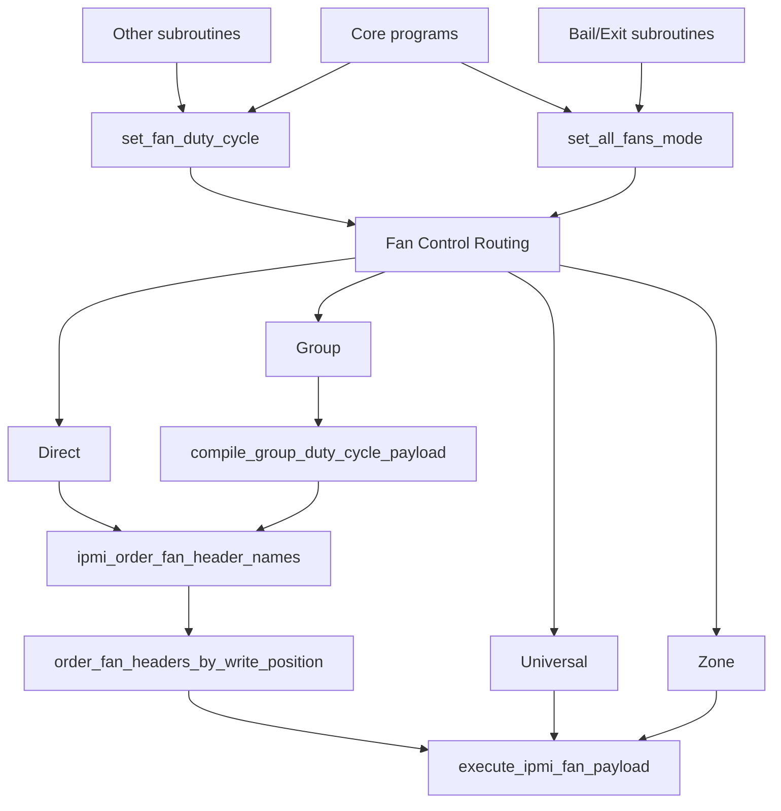

# Fan Write Order Mapping

Of the [fan control methods](fan-control-methods.md), the Direct and Group method types require a pre-determined fan header write-map. This is a template customized for each motherboard. It determines the fan header ID order in which write commands must be addressed to the fan headers in order to get each fan to behave as expected.

When the fan headers are inventoried, UFC maps them based on the order in which IPMI reports each fan header. UFC assigns an arbitrary fan ID number, and the number for each fan is used from thereon as the de-facto Fan Header ID. However, when the fan control method is either Direct or Group, UFC also needs to know in which order the fans should be addressed for sending fan duty speeds commands to the BMC via IPMI commands. There is a distinction between the two because the BMC does not control the order in which IPMI displays the fan header names during read data operations. However, during data write operations via IPMI or any alternative method of comunicating with the BMC (e.g., [Redfish](/documentation/bmc-and-server-architecture/redfish.md), the BMC has very explicit expectations for what the fan ID is of each fan header.

## Write Fan Order Template
A template must be provided for every motherboard that will utilize the Direct or Group fan control methods. The template must be provided via the `ipmi_fan_write_order` indexed array, which must be defined in a configuration (.conf) file. The ideal location to place the fan write order template is in a motherboard-specific config file. Alternatively, it may be provided in the Builder config file. Regardless of its exact location, it must be specified or the program will fail if the fan-write-order template array is missing.

<<>>

--> group method template write order map
--> direct method template write order map

--> fan group schemas

--> how zones are mapped to groups
--> how universal differs from other methods

## Group Fan Control Method Impact

### Process Logic Order

### Related Include Files (Functions)

#### `order_fan_headers_by_write_position`
Its job is to create arrays required when fan control method is Direct or Group.

- creates array $ipmi_write_position_fan_name[write_position]=fan_name for group fan control method
- creates array $ipmi_write_position_fan_id[write_position]=fan_id for group fan control method
- creates array $ipmi_fan_id_write_position[fan_id]=write_position for direct fan control method

Direct fan control method:
- $ipmi_fan_id_write_position array maps IPMI read fan header ID to IPMI write fan header position
- [$fan_id]=write_position
- Provides direct look-up translation
- $ipmi_write_position_fan_id[] array also needed by execute function under some circumstances

Group fan control method:
- ipmi_write_position_fan_name["$write_position"]="$fan_name"
- stores fan name or special byte type for each IPMI data byte, in sequential write-position order
- ipmi_write_position_fan_id["$write_position"]="$fan_id"
- stores fan id for each write position that is a fan header name
- used to create write order template with fan IDs, since this info is static

This function performs the following tasks:

1. Process fan headers in write order expected by BMC
2. Validates fan names
3. Assigns write positions to each fan ID/name
4. Prepares write order for direct and group fan control methods, respectively

Create complete fan header write order templates that maps IPMI data payload write position to fan header name, fan header ID, and special data bytes. This subroutine is applicable for direct and group type fan control methods only.

Called by the `ipmi_order_fan_header_names` subroutine.

1. fans exist in inventory, but not in template
--> group: we have no way to address or know which fans to address how; abort
--> direct: we dont care we just deal with the fans we found; no impact

2. fans not in inventory, are in template
--> group: we do not know how to address the unexpected fans; we could possibly treat them as dummy bytes
--> direct: no issue as we only care about the fans we know about; no impact

## Direct Fan Control Method Impact

### Process Logic Order

### Related Include Files (Functions)

ipmi_fan_write_order    indexed array that is the template of expected fan headers and reserved words

<<>>

When fan control method = group, fan header names present in the write order template, but not found in fan header inventory must be resolved. Otherwise, it will not be possible to proceed as the write order of IPMI commands will be incorrect. The ad-hoc solution is to substitute 'dummy' values for the missing fan header names. If this is not possible, then the program must be aborted.

Note: when this issue occurs, the most likely cause is that the current system motherboard is being associated by UFC with an incorrect BMC fan schema. Thoroughly cross-check all related config files.

Note: Direct fan control method does not care about unknown/unidentified fan names in the template.

--> scenario below is when fans were not found in inventory, but template expects them and therefore its write order is based
on the presumption the non-discovered fans exist, when they dont

--> so when fan control = group we can solve this by simply sending dummy byte instructions to the fans we know are supposed
to be there but we dont see... this preserves the write order based on the template, which group method depends on

--> for direct method, we also depend on correct write order to get the right write order fan position for any given fan we want
to write to. but as long as we have more fans in the template than were discovered it doesnt matter. we just need to be able to 
match each discovered fan to a valid fan id, and we dont give a crap about anything else

---

## Fan Control Methods Process Flow

