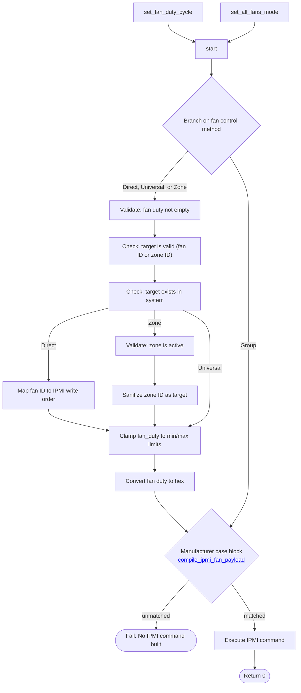

## `execute_ipmi_fan_payload`

| Builder | Launcher | Runtime |
|:-------:|:--------:|:-------:|
|   ✅   |   ✅   |   ✅   |

**Purpose**: Executes IPMI request to alter current fan duty (PWM %) of one or more fan headers.

## **Overview**

This subroutine:
- Consolidated function that processes the final compilation of IPMI raw commands to adjust fan speeds and sends the command
- Applies to all fan control methods
- Calls other subroutines to pre-process vendor specific criteria and validate group fan control method payloads

| Direct | Group | Universal | Zoned |
|:------:|:-----:|:---------:|:-----:|
| ✅ | ✅ | ✅ | ✅ |

## **Importance**
- This subroutine is the actual processor of fan speed change requests.

---

## **Dependencies**
Other subroutines must have been run first. See the fan write-order mapping process flowchart found [here](/documentation/universal-fan-controller/details/fan-write-order-mapping.md#fan-control-methods-process-flow).

## **Inputs**
Inputs are required for all fan control methods ***except for the Group method***.

| Variable/Array Name                |  Value                  | Purpose                            |
|------------------------------------|-------------------------|------------------------------------|
| `$1`                               | integer                 | Requested fan duty (PWM %)         |
| `$2`                               | integer                 | Target (fan ID, zone ID, or group) |

## **Outputs**
None (output is physical execution of fan speed changes).

## **How It Works**
1. Organizes IPMI command payload and data bytes based on fan control method
2. Validates fan control target and fan duty requested
3. Sends fan control command to BMC via IPMI

<strong>Task Summary</strong>

### **Task Summary**
This function performs the following tasks:

1. Validates the fan duty and target input.
1. Calls [`compile_ipmi_fan_payload`](/documentation/universal-fan-controller/details/subroutines/compile_ipmi_fan_payload.md) subroutine that performs the following tasks:
    1. maps fan IDs or zone IDs to IPMI write-order positions.
    1. Applies bounds checking on the fan duty request.
    1. Constructs IPMI raw command payloads.
1. Executes payload using ipmitool raw command.

---

## **Process Flow Diagram**
This diagram reflects how the script ensures alignment between the fan header inventory and the IPMI write sequence, with clear abort conditions when unsafe assumptions would be required.

