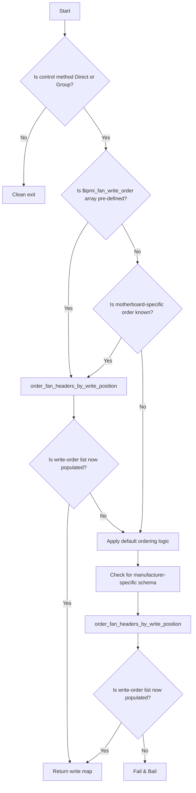

## `ipmi_order_fan_header_names`

| Builder | Launcher | Runtime |
|:-------:|:--------:|:-------:|
|   ✅    |    ❌    |   ❌    |

**Purpose**: Determine fan header write-order sequence for _Direct_ and _Group_ [fan control methods](/documentation/universal-fan-controller/details/fan-control-methods.md).

## **Overview**

This subroutine:
- Establishes correct fan write-order for IPMI raw commands for Direct and Group fan control methods.
- Contains hard-coded write fan header schemas for known motherboard manufacturerers and models.
- When necessary, specifies the type and write-position of reserved data bytes (e.g. dummy, cpu override, etc.) that are required by some motherboards.

Fan header write order is derived in this order (first matching scenario wins):
1. Specified in a config file.
2. Hard-coded in this subroutine.
3. Generic formula: fans are ordered based on a fixed algorithm that orders fans based on their names.

---

## **Why This Matters**

Without this information, Direct and Group fan control methods do not know definitively that fan duty write commands are being sent to the intended fan header.

| Direct | Group | Universal | Zoned |
|:------:|:-----:|:---------:|:-----:|
| ✅ | ✅ | ❌ | ❌ |

- Applicable to direct and group fan control methods only.
- **Required** for direct and group fan control methods.

> [!IMPORTANT]
> Without this information, when the fan control method is _Direct_ or _Group_, UFC will not know how to correctly associate the write-order of each fan header in IPMI fan duty write commands.

### **Fan Order is Static**

IPMI raw fan write commands must be structured in a particular order. This order varies by motherboard manfuacturer, model, and/or BMC implementation. Every motherboard with a BMC chip processes fan speed changes in a particular manner. When a group fan control method is utilized (i.e. every fan header's fan duty must be sent with every IPMI fan speed write command), the fan duty cycles must be arranged in a specific, static order.

<details>
<summary><strong>Impact Details</strong></summary>

> ### Impact Details
> 
> 1. Fan state is irrelevant. all physically present fan headers are inventoried.
> 2. When exact write-order is unknown, 6-pin fan headers are ranked in sequential order (e.g., FAN1_1 > FAN1_2).
> 3. $ipmi_payload_byte_count is assigned here. This optional global variable indicates the total byte length for data portion of the IPMI command payload.
>     1. Applies to Group fan control method only.
>     2. When not set, empty, or = 0, there is no fixed length requirement and the related logic in other subroutines will be ignored.
>
> #### $ipmi_payload_byte_count Variable Usage
>
> The variable $ipmi_payload_byte_count is defined in this subroutine, but is processed by the [```compile_group_duty_cycle_payload```](compile_group_duty_cycle_payload.md) subroutine.
> When the compiled data payload portion of the IPMI command is shorter than the required length, it means the end of the data payload must be padded with 'dummy' or placeholder bytes. This behavior supports BMC fan controller implementations that expect a fixed number of bytes in the payload.
> Some boards also have "override" bytes, which are flags indicating whether or not automatic fan control should be overwritten for a particular fan position. When they exist, these are typically relevant only to CPU fans.

</details>

---

## Requirements

### Dependencies

None.

### **Inputs**

Optional - pre-existing only if specified in a config file:

| Array                              | Key                       | Value                  | Purpose     |
|------------------------------------|---------------------------|------------------------|-------------|
| `ipmi_fan_write_order[]`           | fan header write position | fan header name        | Ordered list of fan write positions |
| `ipmi_payload_byte_count`          | n/a                       | ?                      | Fixed number of bytes to issue in data payload of IPMI raw command (optional) |

---

## **Outputs**
Creates the following mappings (hard-coded in the subroutine) when not already existing:

| Array                              | Key                       | Value                  | Purpose     |
|------------------------------------|---------------------------|------------------------|-------------|
| `ipmi_fan_write_order[]`           | fan header write position | fan header name        | Ordered list of fan write positions |
| `ipmi_payload_byte_count`          | n/a                       | integer or empty       | Fixed number of bytes to issue in data payload of IPMI raw command (optional) |

---

## **How It Works**
1. If fan header write-order mappings were not previously declared in a config file, check if there is a hard-coded look-up table.
2. If no hard-codeed look-up table exists, use generic mapping algorithm.
3. Optionally, pad fixed length write-order string with placeholder bytes as necessary.

<details>
<summary><strong>Task Summary</strong></summary>

> ### **Task Summary**
> This function performs the following tasks:
> 
> 1. Every fan header name is parsed and sorted by its prefix.
> 2. Fans with the same prefix are grouped together and sorted alphabetically.
> 3. When write-order is known, fans are organized by their write-order.
> 4. When write-order is not known, follow guidance based on manufacturer.
> 5. When write-order is not known and there is no guidance based on manufacturer, follow a standardized, but generic pattern (essentially, make an educated guess).

</details>

---

## **Process Flow Diagram**
CheckControlMethod
This diagram reflects how the script ensures alignment between the fan header inventory and the IPMI write sequence, with clear abort conditions when unsafe assumptions would be required.


