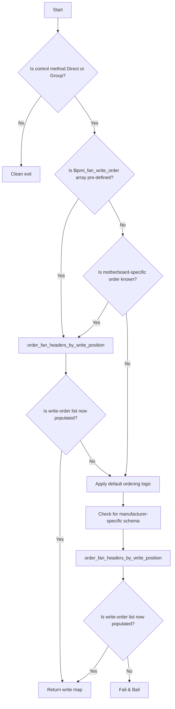

## `function name`

| Builder | Launcher | Runtime |
|:-------:|:--------:|:-------:|
|   ✅    |    ❌    |   ❌    |

**Purpose**: 

## **Overview**

This subroutine:
- abc

| Direct | Group | Universal | Zoned |
|:------:|:-----:|:---------:|:-----:|
| ✅ | ✅ | ❌ | ❌ |

## **Importance**

<details>
<summary><strong>Downstream Impact</strong></summary>

> ### 
> -

</details>

---

## **Dependencies**
Ensure `` has been run before calling this subroutine.

- Bash 4.2+ (associative arrays required)
- `ipmitool` must be installed and available in `$PATH`
- The following subroutines must be sourced prior to use:
  - `load_motherboard_schema`
  - `get_fan_id_from_header`
- Assumes the following variables have been initialized:
  - `fan_headers[]` (array of discovered fan headers)
  - `fan_control_method` (string: "group" or "direct")

## **Inputs**

- `[]` — Array of (from ``)

## **Outputs**
Creates the following mappings:

| Array                              | Key                     | Value                  | Purpose     |
|------------------------------------|-------------------------|------------------------|-------------|
| `[]`                               | ?                       | ?                      | Description |

<details>
<summary><strong>Example</strong></summary>

```bash
```

</details>

---

## **Why This Matters**

<details>
<summary><strong>something important</strong></summary>

> ###
>

</details>

---

## **How It Works**
1. 

<details>
<summary><strong>Task Summary</strong></summary>

### **Task Summary***
This function performs the following tasks:

1.

</details>

---

## **Process Flow Diagram**
This diagram reflects how the script ensures alignment between the fan header inventory and the IPMI write sequence, with clear abort conditions when unsafe assumptions would be required.

```plaintext
```




